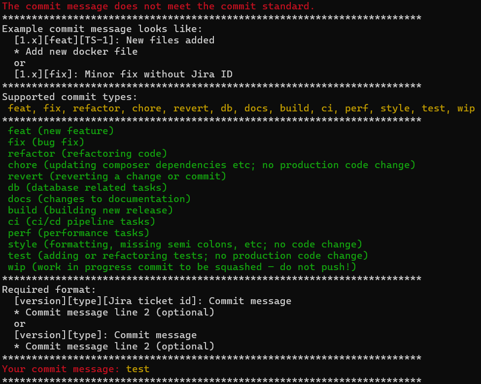

# Validate Commit Messages Using Git Hooks

This repository contains a set of Git hooks that can be used in your projects.

## Installation

You can install the hooks in one of two ways:

### Option 1: Using the Setup Script

1. Clone this repository into your project's root directory.
```bash
git clone https://github.com/kurianvarkey/git-commit-hooks.git
```
2. Run the setup script:

```bash
bash ./setup.sh
```
### Option 2: Manual Setup

1. Copy the .githooks directory into your project's root directory.
2. Run the following commands:
```bash
git init
git config core.hooksPath .githooks
chmod +x .githooks/commit-msg
chmod +x .githooks/pre-commit
```

## commit-msg
.githooks/commit-msg
```bash
#!/bin/bash

# Regex patterns
VERSION_PATTERN="[0-9]+\..+"
JIRA_PATTERN="[A-Z]{1,5}-[0-9]{1,5}"
COMMIT_TYPE_PATTERN="(feat|fix|refactor|chore|revert|db|docs|build|ci|perf|style|test|wip)"

# Full pattern: version, type, optional Jira, and message
PATTERN="^\[${VERSION_PATTERN}\]\[${COMMIT_TYPE_PATTERN}\](\[\s*${JIRA_PATTERN}\s*\])?: .+"
PATTERN_STRING_MATCH="^\[([^\]]+)\]\[([^\]]+)\](?:\[([^\]]+)\])?"

# Read the first line of the commit message
commit=$(head -1 "$1")

# Function to show the help message
show_help() {
    echo -e "\e[31mThe commit message does not meet the commit standard.\e[0m"
    echo "***********************************************************************"
    echo "Example commit message looks like:"
    echo "  [1.x][feat][TS-1]: New files added"
    echo "  * Add new docker file"
    echo "  or"
    echo "  [1.x][fix]: Minor fix without Jira ID"  
    echo "***********************************************************************"
    echo "Supported commit types:"
    echo -e "\e[33m feat, fix, refactor, chore, revert, db, docs, build, ci, perf, style, test, wip \e[0m"
    echo "***********************************************************************"
    echo -e "\e[32m feat (new feature) \e[0m"
    echo -e "\e[32m fix (bug fix) \e[0m"
    echo -e "\e[32m refactor (refactoring code) \e[0m"
    echo -e "\e[32m chore (updating composer dependencies etc; no production code change) \e[0m"
    echo -e "\e[32m revert (reverting a change or commit) \e[0m"
    echo -e "\e[32m db (database related tasks) \e[0m"
    echo -e "\e[32m docs (changes to documentation) \e[0m"
    echo -e "\e[32m build (building new release) \e[0m"
    echo -e "\e[32m ci (ci/cd pipeline tasks) \e[0m"
    echo -e "\e[32m perf (performance tasks) \e[0m"
    echo -e "\e[32m style (formatting, missing semi colons, etc; no code change) \e[0m"
    echo -e "\e[32m test (adding or refactoring tests; no production code change) \e[0m"
    echo -e "\e[32m wip (work in progress commit to be squashed — do not push!) \e[0m"
    echo "***********************************************************************"
    echo "Required format:"
    echo "  [version][type][Jira ticket id]: Commit message"
    echo "  * Commit message line 2 (optional)"
    echo "  or"
    echo "  [version][type]: Commit message"
    echo "  * Commit message line 2 (optional)"
    echo "***********************************************************************"
}

# Validate the pattern
if ! [[ $commit =~ $PATTERN ]]; then
    show_help

    if [[ -n "$commit" ]]; then
        echo -e "\e[31mYour commit message: \e[33m$commit\e[0m"

        if [[ $commit =~ $PATTERN_STRING_MATCH ]]; then
            version="${BASH_REMATCH[1]}"
            type="${BASH_REMATCH[2]}"
            jira="${BASH_REMATCH[3]}"

            # Version format check
            if ! [[ $version =~ ^$VERSION_PATTERN$ ]]; then
                echo -e "\e[31mInvalid version: '$version'\e[0m"
            fi

            # Type check
            if ! [[ $type =~ ^$COMMIT_TYPE_PATTERN$ ]]; then
                echo -e "\e[31mUnsupported commit type: '$type'\e[0m"
            fi

            # Jira ID check, if present
            if [[ -n "$jira" && ! "$jira" =~ ^$JIRA_PATTERN$ ]]; then
                echo -e "\e[31mInvalid Jira ID format: '$jira'\e[0m"
            fi
        fi
    else
        echo -e "\e[31mYour commit message is empty.\e[0m"
    fi

    echo "***********************************************************************"
    exit 1
fi
```

## Configuration

The Git hooks can be configured by modifying the `pre-commit` and `commit-msg` files in the `.githooks` directory.

## Features

### Pre-Commit Hook

* Example usage is to checks for code formatting issues. For example, in this repository, it is using [Laravel Pint](https://github.com/laravel/pint) to check for code formatting issues in PHP files. Please amend the `pre-commit` file to your needs.
* Exits with a non-zero status code if any issues are found.

### Commit Message Hook

* Checks the commit message for compliance with the [Conventional Commits](https://conventionalcommits.org/) specification.
* Exits with a non-zero status code if the commit message does not comply with the specification.
* Supports the following commit types:
	+ `feat`: New feature.
	+ `fix`: Bug fix.
	+ `refactor`: Refactoring.
	+ `chore`: Updating dependencies, etc.
	+ `revert`: Reverting a change.
	+ `db`: Database related tasks.
	+ `docs`: Changes to documentation.
	+ `build`: Building new release.
	+ `ci`: CI/CD pipeline tasks.
	+ `perf`: Performance tasks.
	+ `style`: Formatting, missing semi-colons, etc.
	+ `test`: Adding or refactoring tests.
	+ `wip`: Work in progress commit to be squashed.

### Example Commit Message

```bash
[version][type][Jira ticket id]: Commit message
* Commit message line 2 (optional)
```
 Or
 ```bash
[version][type]: Commit message
```

## Usage

When committing changes to your repository, the hooks will be executed automatically. If you type an invalid commit message, you will see an error message like the one below:



## License

The code in this repository is licensed under the MIT License.
